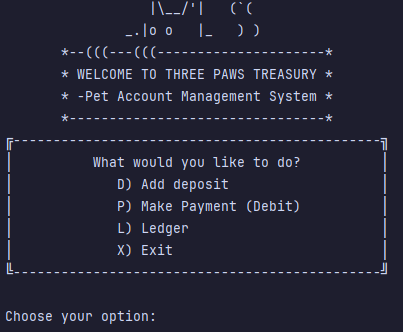
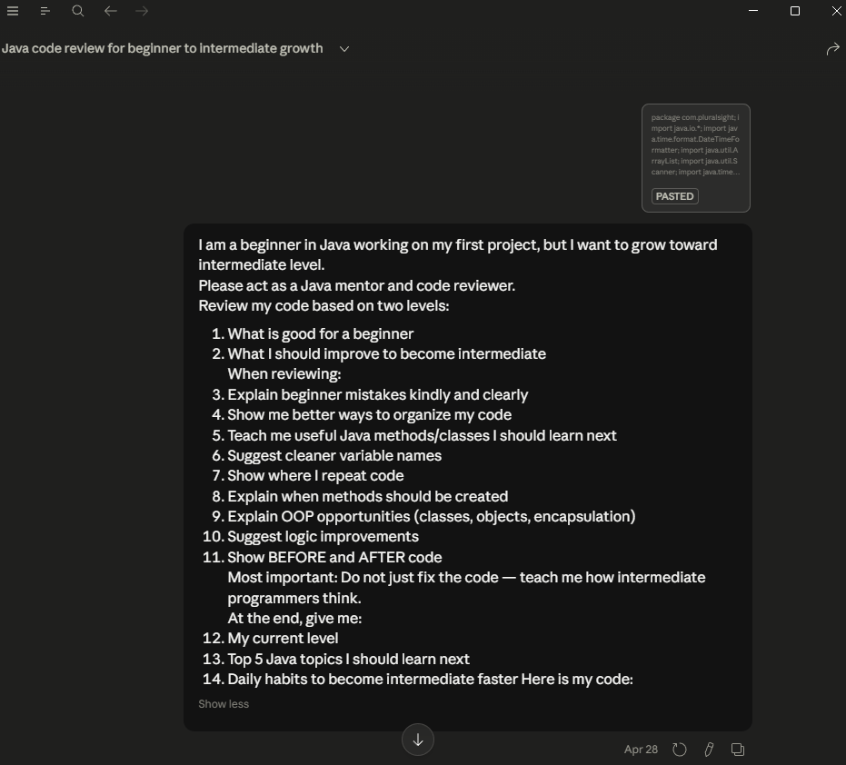

# Welcome to Three Paws Treasury – Pet Account Management System 🐾🐾🐾


## Description

Three Paws Treasury is a Java accounting ledger application made for pet owners who want to keep track of pet-related expenses.

The name **Three Paws Treasury** was inspired by my three cats: **Paolo, Mai, and Binx** 😺.

As a pet owner, I know that pet expenses can add up quickly. Food, vet visits, medications, supplies, and emergencies can become hard to track. This program helps users record deposits and payments, view transactions, run reports, and search for specific transactions.

All transactions are saved in a `transactions.csv` file, so the data is still there even after the program is closed.

---

## Features 🐾

- Add deposits
- Add payments
- View all transactions
- View only deposits
- View only payments
- View reports:
    - Month To Date
    - Previous Month
    - Year To Date
    - Previous Year
- Search transactions by vendor
- Use custom search with optional filters
- Save transactions to a CSV file
- Load saved transactions when the program starts
- Basic input validation so the program does not crash easily

---

## Main Menu Screenshot 🐾

Here is a screenshot of the main menu and welcome banner.



This is one of the parts I am most proud of because I wanted the program to feel friendly and personal, not just like a plain console app.


---
## Built with 🐾🐾
- Java 17 (Amazon Corretto)
- Java standard libraries (java.io, java.time, java.util)
- IntelliJ IDEA

---
## Refactoring Highlight 🐾

Another part of the project that I am proud of is the input validation.

For example, when the user enters something that is not a valid number, the program does not crash. Instead, it shows a friendly message and asks the user to try again.

I am also proud of the refactoring I did. At first, some parts of my code were repeated. For example, I had many places where I printed a question and then used `input.nextLine()` to get the answer.

To make that cleaner, I created this helper method:

```java
public static String askForText(String prompt) {
    System.out.print(prompt);
    return input.nextLine();
}
```
This method helps me ask the user for text input without repeating the same two lines of code many times.

Another refactor I worked on was combining deposits and payments into one method. Instead of having two methods with almost the same code, I used:

```java
addTransaction(boolean isDeposit);
```
If isDeposit is true, the amount stays positive. If it is false, the amount becomes negative because it is a payment.

---
## How to Run the Project🐾
#### 1. Clone the repository.

#### 2. Open the project in IntelliJ IDEA.

#### 3. Make sure the Java version is compatible. I used Java 17 Corretto.

#### 4. Make sure `transactions.csv` is in the project root folder.

#### 5. Open Program.java.

#### 6. Click the green Run button.

#### 7. Follow the menu options in the terminal.

---
## What I Learned🐾🐾🐾
- Read from a CSV file

- Write to a CSV file

- Store objects in an ArrayList

- Create and use a custom Java class

- Use `LocalDate` and `LocalTime`

- Use `try/catch` for input validation

- Use loops and switch statements

- Refactor repeated code into helper methods

- Make my code shorter and easier to read

---
## Future Growth🐾

After I got my project working, I used Claude as a learning tool. I copied parts of my code and asked what I could improve if I wanted to move from beginner Java to intermediate Java.

The feedback helped me understand that my next step is learning how to make code cleaner and more organized. For example, I want to keep practicing refactoring, using helper methods, and eventually separating my code into different classes with different responsibilities.

This project helped me realize that programming is not only about making the code work, but also about making the code easier to understand and improve later.

Below is a screenshot of one of the prompts I used during my learning process:



**I used Claude for feedback and learning guidance, but I made sure I understood the changes before applying them to my project.**
### Author
**Beatriz Jardim**